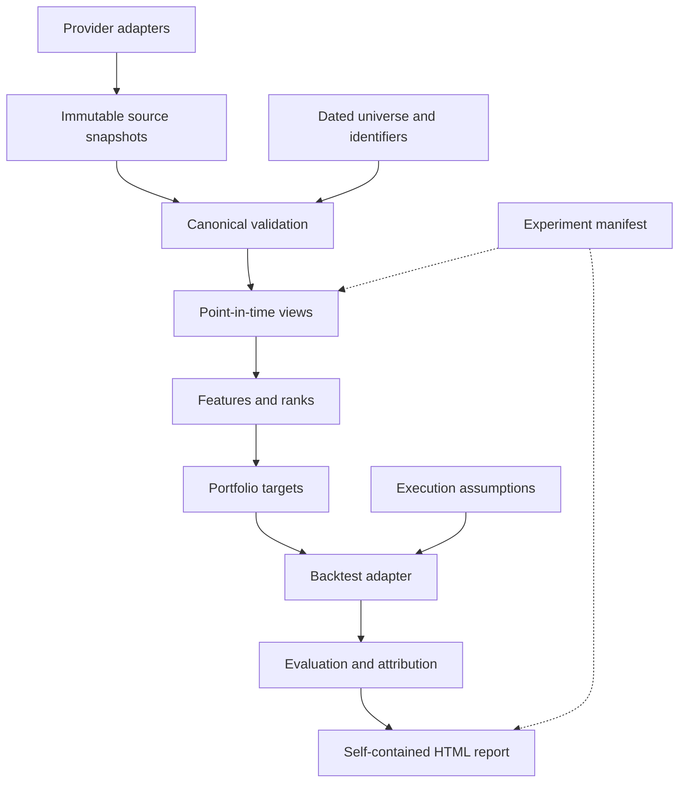

# Architecture and engineering decisions

PQR is a research package and CLI, not a live execution platform. Reports are portable HTML.

## Decisions

1. **DataFrames at analytical boundaries, typed interfaces around them.** Schemas validate each
   boundary; dataclasses and Pydantic validate control/configuration objects. Pandas is familiar
   to reviewers; explicit runtime contracts matter more than pretending a DataFrame is statically typed.
2. **Parquet and DuckDB.** Immutable columnar data and parameterized as-of SQL provide a small,
   inspectable local research stack. No database server or service orchestration is needed.
3. **Vectorized across assets, sequential across time.** Weight drift, cash and execution costs
   require state. A target-weight dot product that rebalances implicitly every day is incorrect.
4. **A small independent oracle.** Tests compare the engine's bisection cost solver with scalar
   accounting and a piecewise-linear closed-form solve, not another call into the engine.
5. **Explicit research modes.** Demonstration permits disclosed retrospective snapshots or
   artificial fixtures. Historical mode requires archive evidence, historical membership,
   resolved terminal events and a forward-built total-return series. Schema validation checks
   consistency; it cannot authenticate a source's truthfulness.
6. **Transparent quality, no value proxy in v1.** Annual ROA avoids mixing current shares,
   historical market caps, and conflicting earnings contexts. Value features can be added once
   dated shares and corporate-action treatment have equivalent data quality.
7. **HTML before an application server.** Reports are self-contained, readable offline and easy
   to inspect in a code review. They embed SVG charts and use no third-party scripts or fonts.
8. **No invented market results.** The included report is an explicitly synthetic verification
   artifact. Live adapters are tested against declared artificial contract fixtures; live API
   entitlement and actual source coverage remain unverified until credentials are supplied.

## Boundaries and extension points

- `data.providers`: `PriceProvider`, `FundamentalsProvider`, `UniverseProvider` protocols.
- `data.schemas`: canonical dataset, metadata, invariants and disk I/O.
- `data.point_in_time`: eligibility before latest-period/latest-vintage selection.
- `features`, `signals`: numerical transforms separate from portfolio decisions.
- `portfolios`: deterministic selection and target construction.
- `execution`: cost conventions and self-financing execution.
- `backtesting`: `BacktestAdapter` protocol and vectorized implementation.
- `evaluation`: finance metrics, chronological windows, attribution and concentration.
- `experiments`: configuration/data/code hashes and reproducibility evidence.
- `reporting`: presentation only; it does not calculate trading decisions.
- `pipeline`, `cli`: orchestration and user-facing commands.

An adapter must fail explicitly on unknown fields or unsupported actions. Add provider contract
fixtures under `tests/` and label them artificial unless they are licensed retained observations.

## Deliberate limits

No optimization, ML, shorting, borrowing, intraday fills, broker connection, taxes, capacity claims,
formal factor regression, or independent out-of-sample performance claim. Cash-only terminal
settlements and supplied total-loss returns are supported. Stock-for-stock mergers, spin-offs,
and security transformations require upstream normalization and evidence. Current ticker exports
cannot establish historical universe membership. The simple ingest command accepts one symbol per
asset; use canonical file ingestion for dated symbol changes rather than splicing tickers blindly.
